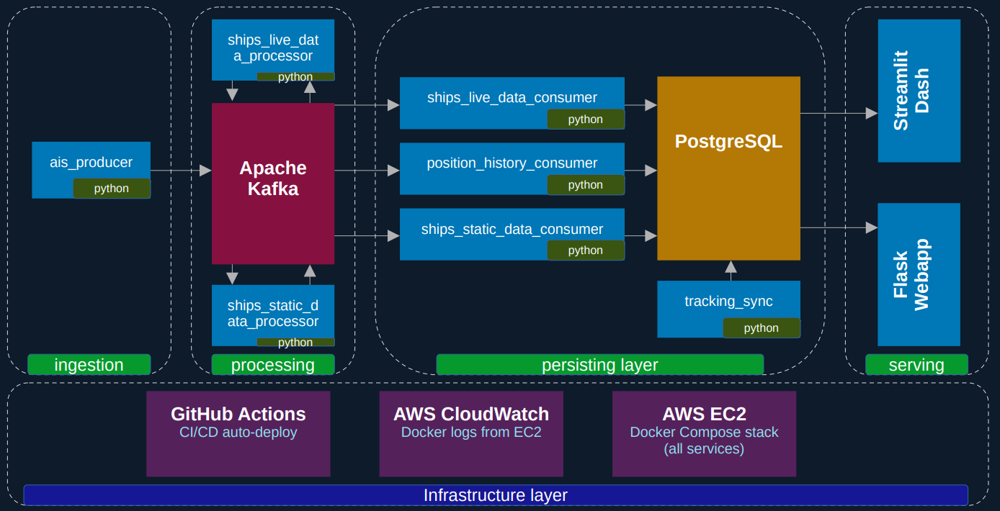

# ⚓ AIS Ship Tracker

Real-time ship tracking using the global [AIS](https://en.wikipedia.org/wiki/Automatic_identification_system) data stream. Live ship positions are ingested via a WebSocket feed, routed through an Apache Kafka pipeline, stored in PostgreSQL, and presented via a Flask live-map and a Streamlit analytics dashboard.

## Architecture



## Database model


## Prerequisites

- [Docker](https://docs.docker.com/get-docker/) & Docker Compose v2
- An API key from [aisstream.io](https://aisstream.io) (free tier available)

## Quick start (local)

**1. Clone the repo**

```bash
git clone https://github.com/thjunge11/myCapstoneProject.git
cd myCapstoneProject
```

**2. Create a `.env` file** in the project root:

```dotenv
# AIS stream API key – get one at https://aisstream.io
API_KEY=your_aisstream_api_key

# PostgreSQL – choose any values for local use
DB_USER=postgres
DB_PASSWORD=changeme
DB_NAME=aisdb

# Optional – Kafka log retention in ms (default 2.5 h)
# KAFKA_LOG_RETENTION_MS=9000000

# Optional – CloudWatch region (only needed on EC2)
# AWS_REGION=eu-central-1
```

**3. Start the full stack**

```bash
docker compose up --build
```

> On first run Docker builds all images and PostgreSQL initialises the schema from `config/db.sql` automatically. Allow ~60 s for Kafka to become healthy before the producer connects.

**4. Open the UIs**

| Service | URL |
|---|---|
| Live map (Flask) | http://localhost:5000 |
| Analytics dashboard (Streamlit) | http://localhost:8501 |
| Kafka UI | http://localhost:8080 |
| PostgreSQL | `localhost:5435` (credentials from `.env`) |

**5. Stop**

```bash
docker compose down        # keep postgres volume
docker compose down -v     # also delete all data
```

## Track specific ships

Edit `config/tracked_ship_ids.json` with the MMSI numbers of ships you want full position history for:

```json
{
  "tracked_ship_ids": [266343000, 255805555]
}
```

Then sync to the database:

```bash
docker compose run --rm tracking-sync
```

## CloudWatch logging

Every container uses the `awslogs` Docker logging driver. For **local dev**, either:
- Comment out the `logging:` sections in `docker-compose.yml`, or
- Configure AWS credentials (`~/.aws/credentials`) with `logs:CreateLogGroup` and `logs:PutLogEvents` permissions.

On EC2 the instance IAM role supplies credentials automatically.

## Deploy to AWS EC2

See [docs/deploy.md](docs/deploy.md) for the full guide. Summary:

1. Launch an Ubuntu EC2 instance and run the one-time setup from `docs/deploy.md`.
2. Add these four **GitHub Secrets** (`Settings → Secrets and variables → Actions`):

   | Secret | Value |
   |---|---|
   | `EC2_HOST` | EC2 public IP or DNS |
   | `EC2_USERNAME` | `ubuntu` |
   | `EC2_SSH_KEY` | Full contents of your `.pem` key file |
   | `ENV_FILE` | Full contents of your local `.env` file |

3. Push to `main` — the `deploy.yml` workflow SSHes into the instance, pulls the latest code, writes the `.env`, and runs `docker compose up --build -d`.

## Project structure

```
├── config/
│   ├── db.sql                        # PostgreSQL schema (auto-applied on first run)
│   └── tracked_ship_ids.json         # MMSIs to record full history for
├── python_apps/
│   ├── ais_producer/                 # WebSocket → Kafka
│   ├── ships_live_data_processor/    # Validates & transforms PositionReport
│   ├── ships_live_data_consumer/     # Kafka → ships_live_data table
│   ├── position_history_consumer/    # Kafka → position_history table
│   ├── ships_static_data_processor/  # Validates & transforms ShipStaticData
│   ├── ships_static_data_consumer/   # Kafka → ships_static_data table
│   └── tracking_sync/                # Syncs tracked_ship_ids.json → DB
├── webapp/                           # Flask live map (MapLibre GL JS)
├── streamlit_dashboard/              # Streamlit analytics dashboard
├── kafka/                            # Standalone Kafka compose (isolated dev)
├── docs/                             # ERD, deployment notes
└── docker-compose.yml                # Unified stack
```

## Tech stack

| Layer | Technology |
|---|---|
| AIS feed | [aisstream.io](https://aisstream.io) WebSocket |
| Message broker | Apache Kafka (Confluent 7.5) + ZooKeeper |
| Stream processing | Python 3.11 · kafka-python · asyncio |
| Database | PostgreSQL 16 |
| Live map | Flask · MapLibre GL JS |
| Analytics | Streamlit · Plotly Express · Pandas |
| Infrastructure | Docker Compose · AWS EC2 · GitHub Actions · CloudWatch |

## Screenshots
### Live map (Flask)


### Streamlit dashboard


