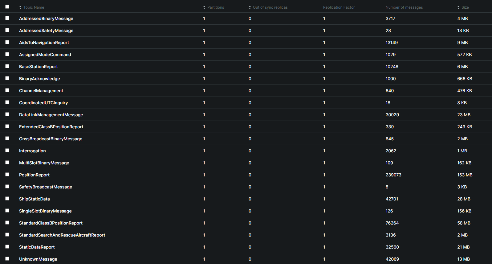
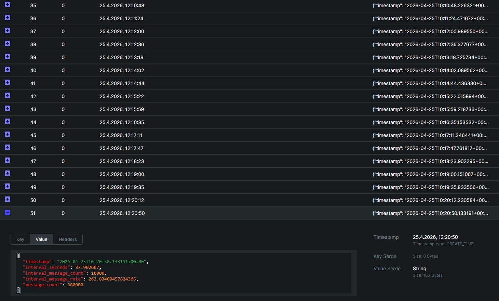
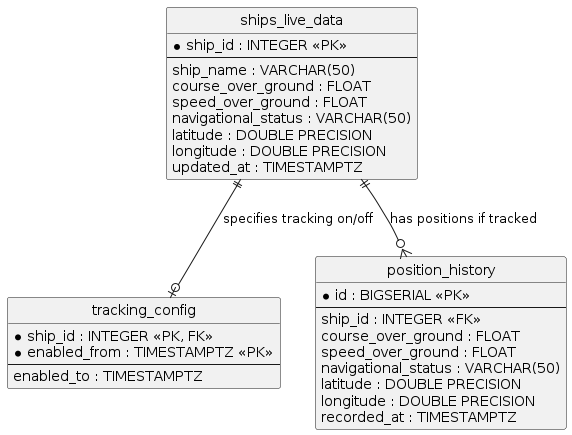

# Data Engineering Capstone Project - AIS Stream Processing

## Data source: 
The AIS (Automatic Identification System) stream is a real-time feed of maritime vessel data, including position reports, navigational status, and other relevant information. The data is provided by AISStream.io, which offers a WebSocket API for accessing the stream.

The API is configured with subscription parameters, including an API key and a bounding box that defines the geographical area of interest. The bounding box is specified as a list of coordinates representing the southwest and northeast corners of the area. In this case, the bounding box covers the entire globe, allowing us to receive data for all vessels worldwide (tbd: maybe we want to narrow this down later to a specific region).

## Draft goals:
- Connect to the AIS stream using the WebSocket API and consume real-time data.
- Process the incoming messages and send them to a Kafka topic for further analysis and storage.
- Implement load statistics to monitor the performance of the data processing pipeline.

## Kafka Producer code:
This is the main script for connecting to the AIS stream, processing messages, and sending them to Kafka. It also includes load statistics that are sent to Kafka every 10,000 messages.

```python
import asyncio
import websockets
import json
from datetime import datetime, timezone
from kafka import KafkaProducer

# load API_Key from .env file
from dotenv import load_dotenv
import os
load_dotenv()
API_Key = os.getenv("API_Key")

async def connect_ais_stream():

    async with websockets.connect("wss://stream.aisstream.io/v0/stream") as websocket:
        
        message_counter = 0
        message_counter_stats_interval = 10000
        message_counter_start = 0
        timestamp_start = datetime.now(timezone.utc)

        # Connect to Kafka broker running in Docker
        producer = KafkaProducer(
            bootstrap_servers='host.docker.internal:9093',
            value_serializer=lambda v: json.dumps(v).encode('utf-8')
        )
        
        # subscribe async to the AIS stream with the API key and bounding box
        subscribe_message = {"APIKey": API_Key, "BoundingBoxes": [[[-90, -180], [90, 180]]]}
        subscribe_message_json = json.dumps(subscribe_message)
        await websocket.send(subscribe_message_json)

        async for message_json in websocket:
            message = json.loads(message_json)
            # print(message)
            producer.send(message["MessageType"], message)  # Send the raw JSON message to Kafka
            producer.flush()  # Ensure the message is sent to Kafka

            # some load statistics
            if message_counter == 0:
                timestamp_start = datetime.now(timezone.utc)      
                print(f"[{timestamp_start}] Connected to AIS stream, starting to process messages...")
                          
            message_counter += 1

            if message_counter % message_counter_stats_interval == 0:
                print(f"[{datetime.now(timezone.utc)}] Processed {message_counter} messages")
                # create some statistisc in json format and send to Kafka
                stats = {
                    "timestamp": datetime.now(timezone.utc).isoformat(),
                    "interval_seconds": (datetime.now(timezone.utc) - timestamp_start).total_seconds(),
                    "interval_message_count": message_counter - message_counter_start,
                    "interval_message_rate": (message_counter - message_counter_start) / (datetime.now(timezone.utc) - timestamp_start).total_seconds(),
                    "message_count": message_counter
                }
                timestamp_start = datetime.now(timezone.utc)  # reset the timer
                message_counter_start = message_counter  # reset the message counter
                producer.send("stats", stats)
                producer.flush()
                print(f"[{datetime.now(timezone.utc)}] Sent stats to Kafka: {stats}")
                

if __name__ == "__main__":
    asyncio.run(connect_ais_stream())

```

## Kafka Producer in action
```bash
$ python main.py
[2026-04-25 09:57:26.524439+00:00] Connected to AIS stream, starting to process messages...
[2026-04-25 09:58:03.021719+00:00] Processed 10000 messages
[2026-04-25 09:58:03.024424+00:00] Sent stats to Kafka: {'timestamp': '2026-04-25T09:58:03.022365+00:00', 'interval_seconds': 36.497926, 'interval_message_count': 10000, 'interval_message_rate': 273.98817127307456, 'message_count': 10000}
[2026-04-25 09:58:37.828248+00:00] Processed 20000 messages
[2026-04-25 09:58:37.829779+00:00] Sent stats to Kafka: {'timestamp': '2026-04-25T09:58:37.828759+00:00', 'interval_seconds': 34.806394, 'interval_message_count': 10000, 'interval_message_rate': 287.30353394264284, 'message_count': 20000}
[2026-04-25 09:59:13.974663+00:00] Processed 30000 messages
[2026-04-25 09:59:13.976221+00:00] Sent stats to Kafka: {'timestamp': '2026-04-25T09:59:13.975179+00:00', 'interval_seconds': 36.14642, 'interval_message_count': 10000, 'interval_message_rate': 276.65257029603487, 'message_count': 30000}
[2026-04-25 09:59:49.305082+00:00] Processed 40000 messages
[2026-04-25 09:59:49.307474+00:00] Sent stats to Kafka: {'timestamp': '2026-04-25T09:59:49.305082+00:00', 'interval_seconds': 35.329903, 'interval_message_count': 10000, 'interval_message_rate': 283.04634745246824, 'message_count': 40000}
[2026-04-25 10:00:27.554189+00:00] Processed 50000 messages
[2026-04-25 10:00:27.556310+00:00] Sent stats to Kafka: {'timestamp': '2026-04-25T10:00:27.554189+00:00', 'interval_seconds': 38.249107, 'interval_message_count': 10000, 'interval_message_rate': 261.4440122745872, 'message_count': 50000}
[2026-04-25 10:01:04.904248+00:00] Processed 60000 messages
[2026-04-25 10:01:04.905472+00:00] Sent stats to Kafka: {'timestamp': '2026-04-25T10:01:04.904248+00:00', 'interval_seconds': 37.350059, 'interval_message_count': 10000, 'interval_message_rate': 267.737194203629, 'message_count': 60000}
[2026-04-25 10:01:42.374835+00:00] Processed 70000 messages
[2026-04-25 10:01:42.379829+00:00] Sent stats to Kafka: {'timestamp': '2026-04-25T10:01:42.374835+00:00', 'interval_seconds': 37.470587, 'interval_message_count': 10000, 'interval_message_rate': 266.875989959805, 'message_count': 70000}
[2026-04-25 10:02:18.936341+00:00] Processed 80000 messages
[2026-04-25 10:02:18.938702+00:00] Sent stats to Kafka: {'timestamp': '2026-04-25T10:02:18.936341+00:00', 'interval_seconds': 36.561506, 'interval_message_count': 10000, 'interval_message_rate': 273.51170928243494, 'message_count': 80000}
[2026-04-25 10:02:55.308609+00:00] Processed 90000 messages
[2026-04-25 10:02:55.309665+00:00] Sent stats to Kafka: {'timestamp': '2026-04-25T10:02:55.308609+00:00', 'interval_seconds': 36.372268, 'interval_message_count': 10000, 'interval_message_rate': 274.934738741065, 'message_count': 90000}
[2026-04-25 10:03:32.290910+00:00] Processed 100000 messages
[2026-04-25 10:03:32.292474+00:00] Sent stats to Kafka: {'timestamp': '2026-04-25T10:03:32.290910+00:00', 'interval_seconds': 36.982301, 'interval_message_count': 10000, 'interval_message_rate': 270.3996162921285, 'message_count': 100000}
[2026-04-25 10:04:08.719868+00:00] Processed 110000 messages
[2026-04-25 10:04:08.721256+00:00] Sent stats to Kafka: {'timestamp': '2026-04-25T10:04:08.719868+00:00', 'interval_seconds': 36.428958, 'interval_message_count': 10000, 'interval_message_rate': 274.50689091903206, 'message_count': 110000}
[2026-04-25 10:04:44.653142+00:00] Processed 120000 messages
[2026-04-25 10:04:44.654356+00:00] Sent stats to Kafka: {'timestamp': '2026-04-25T10:04:44.653142+00:00', 'interval_seconds': 35.933274, 'interval_message_count': 10000, 'interval_message_rate': 278.2935949560288, 'message_count': 120000}
[2026-04-25 10:05:21.792560+00:00] Processed 130000 messages
[2026-04-25 10:05:21.794155+00:00] Sent stats to Kafka: {'timestamp': '2026-04-25T10:05:21.792560+00:00', 'interval_seconds': 37.139418, 'interval_message_count': 10000, 'interval_message_rate': 269.2557002374135, 'message_count': 130000}
```

## Load statistics
| msg / s | msg # | size MB | MB / msg | MB / s | MB / h | GB / d |
|---|---|---|---|---|---|---|
|290|99632|63|0,0006323269632|0,1833748193|660,1493496|15,47225038|

## Message statistics
Kafka topics in Kafka UI:

statts topic in Kafka UI:


## Message structure:
The messages received from the AIS stream are in JSON format and contain various fields related to vessel information, position reports, navigational status and need to be explored in more detail. The exact structure of the messages may vary depending on the message type.

Example messages: PositionReport, StandardClassBPositionReport, ShipStaticData, StaticDataReport, UnknownMessage

```json
{
	"Message": {
		"PositionReport": {
			"Cog": 142.9,
			"CommunicationState": 33713,
			"Latitude": 53.09018833333334,
			"Longitude": 5.854496666666666,
			"MessageID": 1,
			"NavigationalStatus": 0,
			"PositionAccuracy": true,
			"Raim": true,
			"RateOfTurn": -128,
			"RepeatIndicator": 0,
			"Sog": 4.5,
			"Spare": 0,
			"SpecialManoeuvreIndicator": 0,
			"Timestamp": 25,
			"TrueHeading": 511,
			"UserID": 244730610,
			"Valid": true
		}
	},
	"MessageType": "PositionReport",
	"MetaData": {
		"MMSI": 244730610,
		"MMSI_String": 244730610,
		"ShipName": "VROUWE CORNELIA",
		"latitude": 53.09019,
		"longitude": 5.8545,
		"time_utc": "2026-04-25 09:47:25.26746452 +0000 UTC"
	}
}
```
```json
{
	"Message": {
		"StandardClassBPositionReport": {
			"AssignedMode": false,
			"ClassBBand": true,
			"ClassBDisplay": false,
			"ClassBDsc": true,
			"ClassBMsg22": true,
			"ClassBUnit": true,
			"Cog": 153.9,
			"CommunicationState": 393222,
			"CommunicationStateIsItdma": true,
			"Latitude": 40.74870333333333,
			"Longitude": 13.859405,
			"MessageID": 18,
			"PositionAccuracy": true,
			"Raim": true,
			"RepeatIndicator": 0,
			"Sog": 6.1,
			"Spare1": 0,
			"Spare2": 0,
			"Timestamp": 39,
			"TrueHeading": 160,
			"UserID": 247193240,
			"Valid": true
		}
	},
	"MessageType": "StandardClassBPositionReport",
	"MetaData": {
		"MMSI": 247193240,
		"MMSI_String": 247193240,
		"ShipName": "LIBIDINE            ",
		"latitude": 40.7487,
		"longitude": 13.85941,
		"time_utc": "2026-04-25 09:47:24.826517079 +0000 UTC"
	}
}
```
```json
{
	"Message": {
		"ShipStaticData": {
			"AisVersion": 2,
			"CallSign": "LFJA",
			"Destination": "OSLO",
			"Dimension": {
				"A": 9,
				"B": 22,
				"C": 2,
				"D": 6
			},
			"Dte": false,
			"Eta": {
				"Day": 1,
				"Hour": 0,
				"Minute": 0,
				"Month": 1
			},
			"FixType": 1,
			"ImoNumber": 6519522,
			"MaximumStaticDraught": 2.1,
			"MessageID": 5,
			"Name": "NOBEL",
			"RepeatIndicator": 0,
			"Spare": false,
			"Type": 69,
			"UserID": 257038990,
			"Valid": true
		}
	},
	"MessageType": "ShipStaticData",
	"MetaData": {
		"MMSI": 257038990,
		"MMSI_String": 257038990,
		"ShipName": "NOBEL",
		"latitude": 59.90767,
		"longitude": 10.73383,
		"time_utc": "2026-04-25 09:47:24.886451648 +0000 UTC"
	}
}
```
```json
{
	"Message": {
		"StaticDataReport": {
			"MessageID": 24,
			"PartNumber": true,
			"RepeatIndicator": 0,
			"ReportA": {
				"Name": "",
				"Valid": false
			},
			"ReportB": {
				"CallSign": "XPI6030",
				"Dimension": {
					"A": 5,
					"B": 5,
					"C": 2,
					"D": 2
				},
				"FixType": 15,
				"ShipType": 37,
				"Spare": 0,
				"Valid": true,
				"VenderIDModel": 2,
				"VenderIDSerial": 387307,
				"VendorIDName": "SRT"
			},
			"Reserved": 0,
			"UserID": 219034965,
			"Valid": true
		}
	},
	"MessageType": "StaticDataReport",
	"MetaData": {
		"MMSI": 219034965,
		"MMSI_String": 219034965,
		"ShipName": "",
		"latitude": 56.16499,
		"longitude": 10.22082,
		"time_utc": "2026-04-25 09:47:25.360549773 +0000 UTC"
	}
}
```
```json
{
	"Message": {
		"UnknownMessage": {}
	},
	"MessageType": "UnknownMessage",
	"MetaData": {
		"MMSI": 244615283,
		"MMSI_String": 244615283,
		"ShipName": "PANNENKOEKENBOOT II",
		"latitude": 51.90686,
		"longitude": 4.48115,
		"time_utc": "2026-04-25 09:47:25.320917684 +0000 UTC"
	}
}
```

## Findings:
- messages share common metatdata fields: MMSI, ShipName, latitude, longitude, time_utc
- messages have different message types and structures, but all contain a "Message" field with the actual message content and a "MessageType" field that indicates the type of the message (e.g., PositionReport, StandardClassBPositionReport, ShipStaticData, StaticDataReport, UnknownMessage)
- the message types have different fields and structures, but all contain a "UserID" field that corresponds to the MMSI in the metadata, which can be used for joining messages of different types related to the same vessel
- the message types also contain a "Valid" field that indicates whether the message is valid or not, which can be used for filtering out invalid messages in the analysis
- even the "UnknownMessage" type contains the common metadata fields, which can be used for analysis and visualization of vessel positions even if the message content is not recognized


## Next steps:
- Implement a Kafka consumer to read the messages from the Kafka topic and perform some basic analysis or storage (e.g., save to a database or file system).
- Visualize ShipPositions on map with streamlit.map for crosschecking bounding box correctness
- Explore the message structure and extract relevant fields for analysis
- Set up a monitoring dashboard to visualize the load statistics and message processing performance in real-time.

# 04.05.2026
- AIS final data model
  
  

- AIS NavigationalStatus code → human-readable string (ITU-R M.1371-5)
	``` python
	NAV_STATUS_NOT_DEFINED = 15  # AIS default / not available value

	NAVIGATIONAL_STATUS: dict[int, str] = {
		0: "Under way using engine",
		1: "At anchor",
		2: "Not under command",
		3: "Restricted manoeuvrability",
		4: "Constrained by her draught",
		5: "Moored",
		6: "Aground",
		7: "Engaged in fishing",
		8: "Under way sailing",
		9: "Reserved for future use",
		10: "Reserved for future use",
		11: "Power-driven vessel towing astern",
		12: "Power-driven vessel pushing ahead or towing alongside",
		13: "Reserved for future use",
		14: "AIS-SART is active",
		15: "Not defined",
	}
	```

- Application architecture

``` code
  Data source: aisstream.io websocket (WebSocket API, subscription with API key and bounding box)
        ↓ 
  Kafka Producer (Python) input topics (message["MessageType"], message)
        ↓ 
  Kafka ELT Consumer (Python) reads from Kafka topic "PositionReport"
        ↓ 
  [validate and transform data]
		↓
  Kafka ELT Producer (Python) writes to Kafka topic "ships_live_data"
		↓
  Kafka Consumer (Python) reads from Kafka topic "ships_live_data" and writes to PostgreSQL table "ships_live_data"
  Kafka Consumer (Python) reads from Kafka topic "ships_live_data" and writes to PostgreSQL table "position_history" for active tracked ships from table "tracking_config"
		↓
  FlaskWebApp (Python) reads from PostgreSQL tables "ships_live_data" and "position_history" and visualizes ship positions on a map with MapLibre GL JS
  
```

Dev
  - position_history needs partitioning by recorded_at
  - clean live data after 1 hour for oudated
  - somehow mark ships as "inactive" if no new position reports received for a certain time (e.g., 30 minutes) and move them to a separate table "ships_inactive_data" or set a flag in the "ships_live_data" table, so that they can be visualized differently on the map (e.g., with a different color or icon) 
  - make the dots in position track clickable for getting details
  - switch to blend out live data chips

Ops
- make python apps containerized with Docker and run them in separate containers for better scalability and maintainability
- use docker-compose to orchestrate the different containers (Kafka, PostgreSQL, Kafka Producer, Kafka ELT Consumer, Kafka ELT Producer, FlaskWebApp)
- gather logs rom for error statistics
